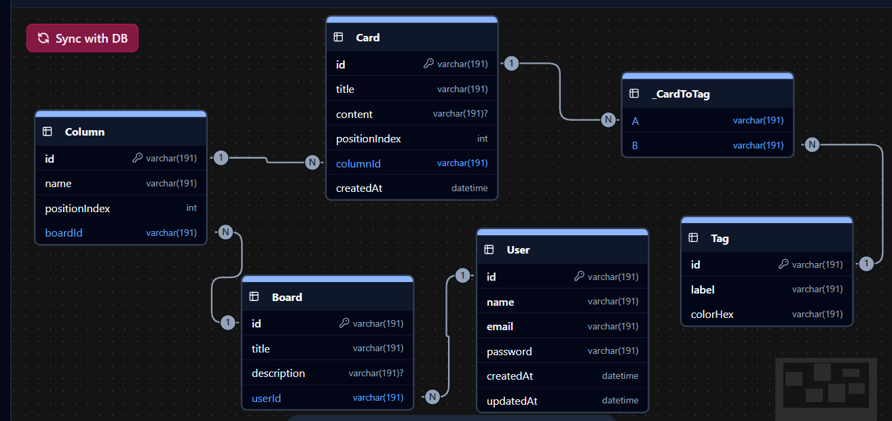

# Backend API for Collaborative Knowledge Board

A high-performance, type-safe REST API built with **Express.js**, mimicking the modular architecture of **NestJS**. This project leverages **Prisma** for database management and **Zod** for runtime validation, ensuring a robust developer experience.

## 📊 Database Schema Diagram
### Database and ORM choice
I used MySQL with Prisma ORM because it provides strong relational support and Prisma gives type-safe database queries.


---

## 🏗️ Architecture & Folder Structure

This project uses a **Module-Based Architecture** (Domain-Driven Design). Instead of grouping by technical type (controllers, models), we group by **feature**.

```
stage_0/
├── package.json
├── prisma/
│   └── migrations/
│       └── 20260304140821_board_models/
│           └── migration.sql
├── src/
│   ├── common/
│   │   └── middleware/
│   │       └── validation.middleware.js
|   |   
│   └── modules/
│       ├── auth/
│       │   ├── auth.routes.ts
│       │   ├── auth.controller.js
│       │   └── dto/
│       │       └── login.dto.js
│       ├── board/
│       │   ├── board.routes.ts
│       │   ├── board.controller.ts
│       │   └── dto/
│       │       └── board.dto.ts
│       ├── column/
│       │   ├── column.routes.ts
│       │   ├── column.controller.ts
│       │   └── dto/
│       │       └── column.dto.ts
│       ├── card/
│       │   ├── card.routes.ts
│       │   ├── card.controller.ts
│       │   └── dto/
│       │       └── card.dto.ts
│       └── tag/
│           ├── tag.routes.ts
│           ├── tag.controller.ts
│           └── dto/
│               └── tag.dto.ts
└── …other config files, scripts, etc.
```

### Why this structure?

1. **Scalability:** Adding a new feature is as simple as creating a new folder in `modules/`.
2. **Encapsulation:** Logic is kept close to where it’s used. A change in one module won’t
   accidentally break another.
3. **Developer ergonomics:** Each module contains its own routes, controllers, DTOs,
   and any other domain-specific code.

---

## 🛠️ Key Engineering Decisions

### 1. Prisma as a Singleton

We initialize the `PrismaClient` once in `src/config/database.ts`. This prevents the
application from exhausting the MySQL connection pool during high traffic, which is a
common pitfall in serverless or high-concurrency Express apps.

### 2. The "Guard" Pattern (JWT)

Instead of messy `if (authorized)` checks inside controllers, we use an **AuthGuard**
middleware. This acts as a gatekeeper, ensuring that the controller only executes if a
valid JWT is present, keeping our business logic "dry."

### 3. Validation via Zod

We chose **Zod** over Joi or express-validator because it offers **Static Type
Inference**. This means our TypeScript interfaces and our runtime validation schemas are
always in sync, eliminating “it‑worked‑in‑development” type errors.

### 4. Relationship Handling

I leverage Prisma’s **Fluent API** for relationships. For example, when fetching a User,
we can optionally `include` related records without writing complex SQL `JOIN`
statements, maintaining readability without sacrificing performance.

---

