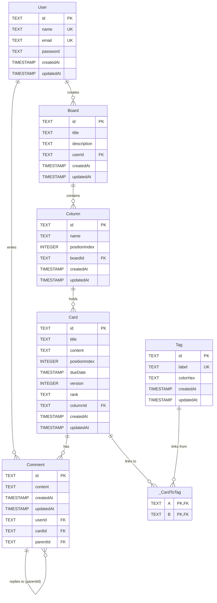

# Backend API for Collaborative Knowledge Board

A high-performance, type-safe REST API built with **Express.js**, mimicking the modular architecture of **NestJS**. This project leverages **Prisma** for database management and **Zod** for runtime validation, ensuring a robust developer experience.

## Database Schema Diagram
### Database and ORM choice
I used MySQL with Prisma ORM because it provides strong relational support and Prisma gives type-safe database queries.
## Database Schema


```mermaid
erDiagram
    User {
        TEXT id PK
        TEXT name UK
        TEXT email UK
        TEXT password
        TIMESTAMP createdAt
        TIMESTAMP updatedAt
    }
    
    Board {
        TEXT id PK
        TEXT title
        TEXT description
        TEXT userId FK
        TIMESTAMP createdAt
        TIMESTAMP updatedAt
    }
    
    Column {
        TEXT id PK
        TEXT name
        INTEGER positionIndex
        TEXT boardId FK
        TIMESTAMP createdAt
        TIMESTAMP updatedAt
    }
    
    Card {
        TEXT id PK
        TEXT title
        TEXT content
        INTEGER positionIndex
        TIMESTAMP dueDate
        INTEGER version
        TEXT rank
        TEXT columnId FK
        TIMESTAMP createdAt
        TIMESTAMP updatedAt
    }
    
    Tag {
        TEXT id PK
        TEXT label UK
        TEXT colorHex
        TIMESTAMP createdAt
        TIMESTAMP updatedAt
    }
    
    Comment {
        TEXT id PK
        TEXT content
        TIMESTAMP createdAt
        TIMESTAMP updatedAt
        TEXT userId FK
        TEXT cardId FK
        TEXT parentId FK
    }
    
    _CardToTag {
        TEXT A PK, FK
        TEXT B PK, FK
    }

    %% Relationships
    User ||--o{ Board : "creates"
    Board ||--o{ Column : "contains"
    Column ||--o{ Card : "holds"
    
    User ||--o{ Comment : "writes"
    Card ||--o{ Comment : "has"
    Comment ||--o{ Comment : "replies to (parentId)"
    
    Card ||--o{ _CardToTag : "links to"
    Tag ||--o{ _CardToTag : "links from"
```

---

## Architecture & Folder Structure

This project uses a **Module-Based Architecture** (Domain-Driven Design). Instead of grouping by technical type (controllers, models), we group by **feature**.

```
.
├── README.md
├── architectural_evolution.md
├── clean_dist_dir.sh
├── compose.yml
├── database schema cropped.png
├── db_schema.png
├── jest.config.ts
├── package-lock.json
├── package.json
├── prisma
│   ├── migrations
│   │   ├── 20260320135747_init
│   │   │   └── migration.sql
│   │   └── migration_lock.toml
│   └── schema.prisma
├── prisma.config.js
├── prisma.config.ts
├── src
│   ├── __mock__
│   │   ├── prisma.mock.ts
│   │   └── utils.ts
│   ├── app.ts
│   ├── common
│   │   ├── events
│   │   │   └── event-emitter.ts
│   │   ├── middleware
│   │   │   ├── auth.middleware.ts
│   │   │   ├── error.middleware.ts
│   │   │   ├── socket_auth.middleware.ts
│   │   │   └── validation.middleware.ts
│   │   └── utils
│   │       ├── helper.res.ts
│   │       └── lexorank.utils.ts
│   ├── config
│   │   ├── database.ts
│   │   ├── logger.ts
│   │   └── swagger.ts
│   ├── e2e
│   │   └── app.test.ts
│   ├── gateways
│   │   ├── board.gateway.docs.ts
│   │   └── board.gateway.ts
│   ├── modules
│   │   ├── auth
│   │   │   ├── auth.controller.ts
│   │   │   ├── auth.routes.ts
│   │   │   ├── auth.service.ts
│   │   │   └── dto
│   │   │       └── login.dto.ts
│   │   ├── board
│   │   │   ├── board.controller.ts
│   │   │   ├── board.routes.ts
│   │   │   ├── board.service.ts
│   │   │   ├── board.spec.ts
│   │   │   └── dto
│   │   │       └── board.dto.ts
│   │   ├── card
│   │   │   ├── card.controller.ts
│   │   │   ├── card.routes.ts
│   │   │   ├── card.service.ts
│   │   │   ├── card.spec.ts
│   │   │   └── dto
│   │   │       └── card.dto.ts
│   │   ├── column
│   │   │   ├── column.controller.ts
│   │   │   ├── column.routes.ts
│   │   │   ├── column.service.ts
│   │   │   ├── column.spec.ts
│   │   │   └── dto
│   │   │       └── column.dto.ts
│   │   ├── comment
│   │   │   ├── comment.controller.ts
│   │   │   ├── comment.routes.ts
│   │   │   ├── comment.service.ts
│   │   │   ├── comment.spec.ts
│   │   │   └── dto
│   │   │       └── comment.dto.ts
│   │   └── user
│   │       ├── dto
│   │       │   └── user.dto.ts
│   │       ├── user.controller.ts
│   │       ├── user.routes.ts
│   │       ├── user.service.spec.ts
│   │       └── user.service.ts
│   ├── server.ts
│   └── types
│       └── index.d.ts
└── tsconfig.json
```

### Why this structure?

1. **Scalability:** Adding a new feature is as simple as creating a new folder in `modules/`.
2. **Encapsulation:** Logic is kept close to where it’s used. A change in one module won’t
   accidentally break another.
3. **Developer ergonomics:** Each module contains its own routes, controllers, DTOs,
   and any other domain-specific code.

---

## Key Engineering Decisions

### 1. Prisma as a Singleton

We initialize the `PrismaClient` once in `src/config/database.ts`. This prevents the
application from exhausting the MySQL connection pool during high traffic, which is a
common pitfall in serverless or high-concurrency Express apps.

### 2. The "Guard" Pattern (JWT)

Instead of messy `if (authorized)` checks inside controllers, we use an **AuthGuard**
middleware. This acts as a gatekeeper, ensuring that the controller only executes if a
valid JWT is present, keeping our business logic "dry."

### 3. Validation via Zod

We chose **Zod** over Joi or express-validator because it offers **Static Type
Inference**. This means our TypeScript interfaces and our runtime validation schemas are
always in sync, eliminating “it‑worked‑in‑development” type errors.

### 4. Relationship Handling

I leverage Prisma’s **Fluent API** for relationships. For example, when fetching a User,
we can optionally `include` related records without writing complex SQL `JOIN`
statements, maintaining readability without sacrificing performance.


# Conflict Resolution Strategy: Optimistic Concurrency Control (OCC)

The system utilizes **Versioning** rather than `updatedAt` timestamps to manage data integrity. While timestamps are common, they can suffer from precision loss (e.g., millisecond truncation in MySQL). In contrast, an **integer version number** provides a definitive, fail-safe source of truth.

## Why Versioning?

* **Industry Standard:** Used by platforms like Jira, Linear, and Trello.
* **Precision:** Avoids the "lost update" problem caused by clock drift or database rounding.
* **Reliability:** Simple integer comparisons ensure that two users never overwrite each other blindly.

---

## How it Works (The Lifecycle)

### 1. The State

A record (e.g., a Card) is initialized in the database with `version: 1`.

### 2. The Fetch

Two users, **User A** and **User B**, load the board simultaneously. Both local states now hold the card at `version: 1`.

### 3. The First Update

**User A** modifies the card title. The frontend sends the current version back to the server:

```http
PATCH /cards/5 
{ 
  "title": "New Title", 
  "version": 1 
}

```

### 4. The Server Action

The database executes an atomic update:

* **Query:** `UPDATE cards SET title = 'New Title', version = 2 WHERE id = 5 AND version = 1;`
* **Result:** The record is updated because the version matched.

### 5. The Conflict

**User B** (still holding `version: 1`) attempts to change the description. Their frontend sends:

```http
PATCH /cards/5 
{ 
  "description": "Updated Description", 
  "version": 1 
}

```

### 6. The Rejection

The database looks for Card 5 where `version == 1`. Because the version is now `2`, the query affects **0 rows**. The server detects this mismatch and returns a `409 Conflict` error.

### 7. The Rollback & Sync

Upon receiving the `409` error, **User B’s** frontend:

1. **Rolls back** the optimistic UI change to prevent "ghost" data.
2. **Fetches** the latest data (`version: 2`).
3. **Notifies** the user that the card was updated by someone else.

---

## Performance & Scaling Strategy

This API is designed to handle high-throughput, real-time board interactions without degrading database performance. 

### 1. Database Query Optimization
- **N+1 Prevention:** All nested data relationships (Boards -> columns -> Cards -> Comments) are resolved using Prisma's `include` to execute single-query SQL `JOIN`s, entirely eliminating N+1 loop queries.

### 2. Strategic Indexing
Indexes are applied to foreign keys and sort properties to prevent full-table sequential scans:
- `@@index([boardId])` on `column`
- `@@index([columnId, rank])` on `Card` (Crucial for O(1) LexoRank sorting)
- `@@index([cardId])` & `@@index([parentId])` on `Comment`

### 3. Pagination Architecture
- **Offset Pagination:** Utilized for high-level resources (e.g., fetching a user's Boards).
- **Cursor Pagination:** Utilized for granular, high-volume resources to maintain constant-time database performance regardless of depth.